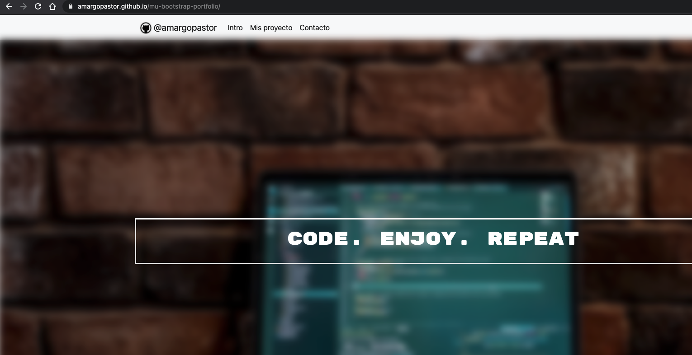
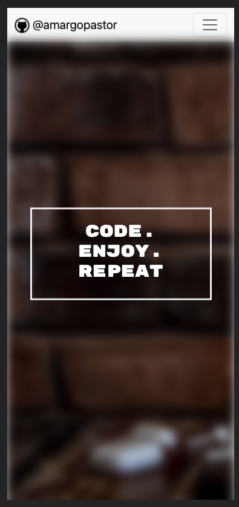
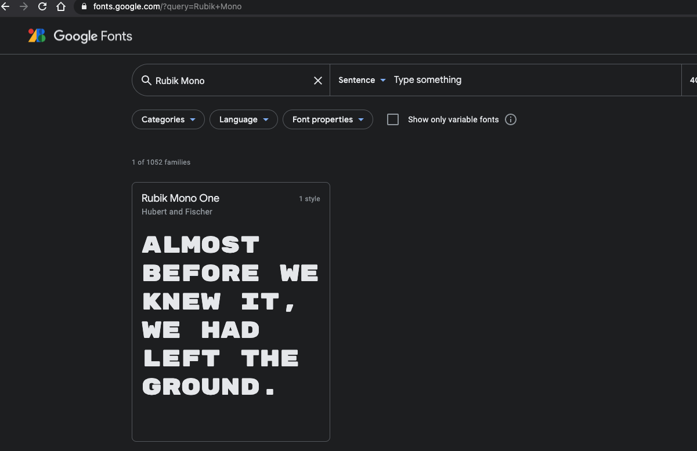
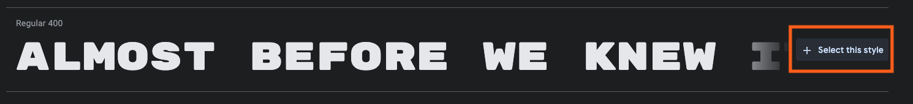
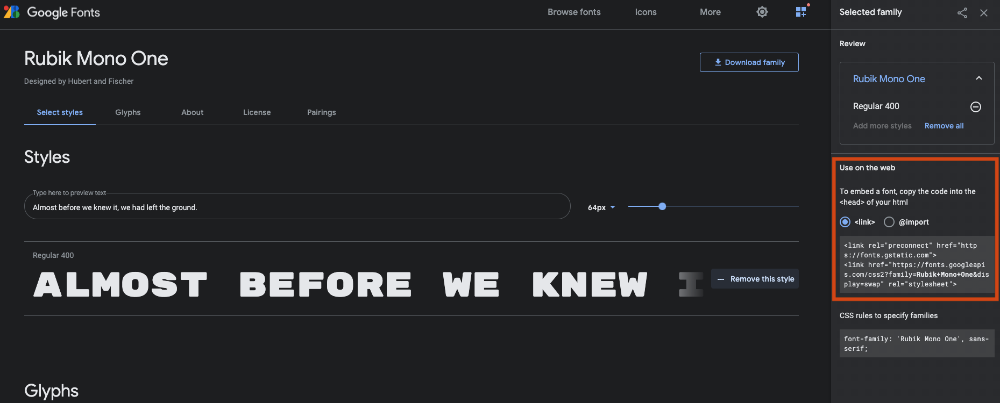
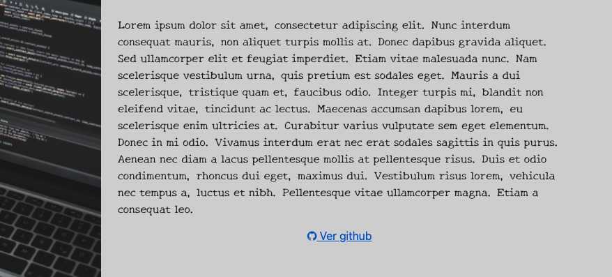
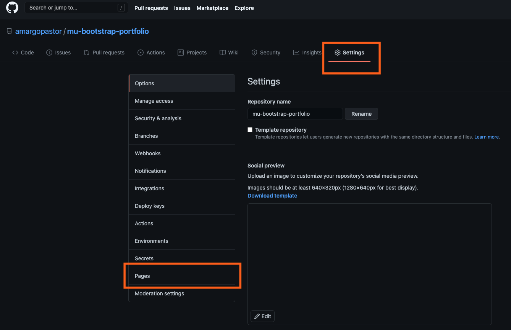
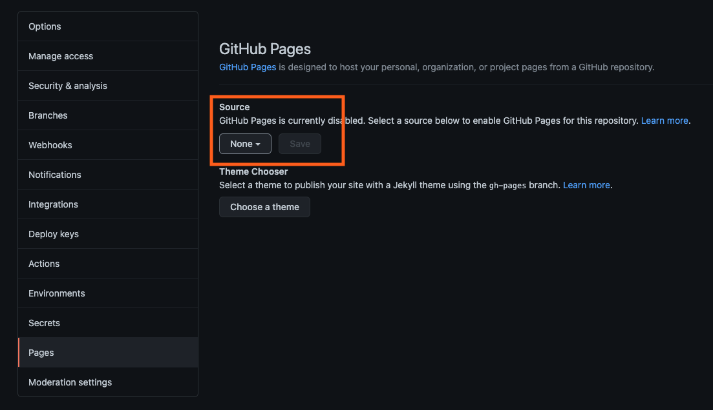
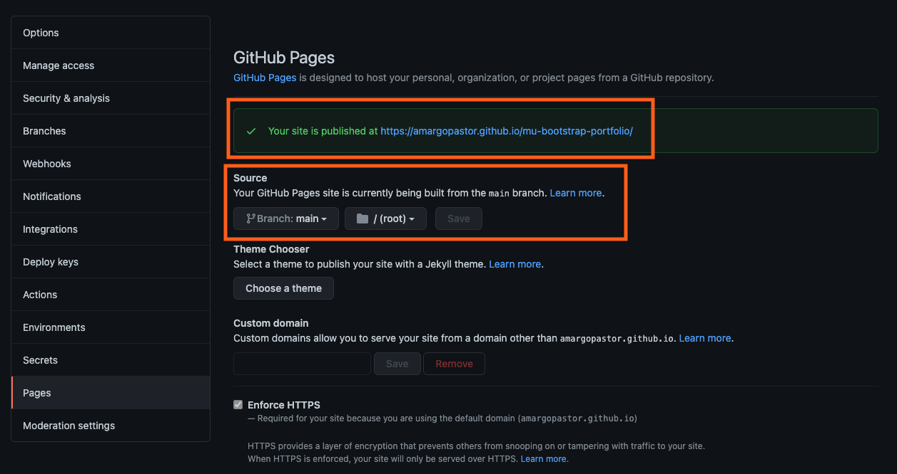

# HTML5 & CSS: Prepara y publica tu portfolio

Sea cual sea tu rama profesional, en este artículo aprenderás a crear tu propio `portfolio` de manera sencilla y rápida.

En tu nuevo portfolio podrás compartir tus `trabajos` más destacados, una `trayectoria` profesional o algunas de tus mejores `creatividades`. Además, te enseñaremos a publiar el resultado final en la web para que esté accesible desde cualquier parte.

Para todo ello sólo necesitarás conocimientos básicos de `HTML`, `CSS` y una cuenta en [www.github.com](https://github.com/).

¡Vamos allá!

## Table of Contents

1. [¿Why Bootstrap?](#1Why-Bootstrap)
1. [We have used](#2We-have-used)
1. [Getting started](#3Getting-started)
1. [Code along](#4Code-along)
1. [GitHub pages](#5GitHub-pages)
1. [Results](#6Results)
1. [Resources](#7Resources)
1. [Special thanks to](#8Special-thanks-to)

## 1.¿Why Bootstrap?

Si tuvieramos que [definir Bootstrap](https://getbootstrap.com/) de una manera sencilla diríamos que se trata de una librería de maquetación web donde muchas de las decisiones de estilo y ejecución ya están tomadas.

Al ser un recurso de código abierto (es decir, cualquiera puede utilizarlo de manera gratuita) es ideal para nuestros primeros pasos en el mundo del diseño.

Una de sus principales ventajas es el `resize`: el contenido mostrado de la página se adapta según el tamaño de la pantalla donde se consume. Esto quiere decir que nuestro portfolio tendrá siempre una presencia óptima lo visualicemos desde ordenador, tablet o móvil:

- Ordenador:

  

- Móvil:

  

Dado que gran parte del [consumo de internet](https://blogs.perficient.com/2019/04/11/mobile-vs-desktop-traffic-in-2019/) se produce desde [dispositivos móviles](https://elpais.com/tecnologia/2020-03-05/el-915-de-los-internautas-ya-accede-a-internet-a-traves-del-movil.html), es importante vigilar que nuestro diseño se adapte correctamente. Por suerte para nosotros, los componentes de Bootstrap ya vienen preconfigurados para tal fin. No obstante, no dejes de revisar las `herramientas de desarrollador en tu navegador` para comprobar distintos `resizes` de tu página.

## 2.We have used

Aquí te dejamos una pequeña lista con los recursos que hemos empleado. Verás que todas nuestras herramientas y fuentes son de acceso libre y gratuito:

- [Visual Studio Code](https://code.visualstudio.com/)
- [Git](https://git-scm.com/)
- [GitHub](https://github.com/)
- Conocimientos básicos de [HTML](https://developer.mozilla.org/es/docs/Web/HTML) & [CSS](https://developer.mozilla.org/es/docs/Web/CSS)
- [Bootstrap](https://getbootstrap.com/)
- [Google fonts](https://fonts.google.com/)
- Algunas imágenes de [UNSPLASH](https://unsplash.com/)
- [AOS](https://michalsnik.github.io/aos/)

## 3.Getting started

Puedes trabajar de la manera que te resulte más cómodo (o estés más habituad@), pero nosotros te recomendamos los siguientes pasos:

- Instala `GIT`en tu ordenador.
- Inicia sesión con tu cuenta en la página `GitHub`.
- Inicia un nuevo repositorio en `GitHub` y vinculalo con tu carpeta local.
- Abre `Visual Studio Code` o cualquier otro editor de código.
- ¡A programar!

## 4.Code along

### 4.1.Basic operative template

Comenzamos creando una plantilla básica de HTML y un fichero css para nuestros estilos personalizados. Echa un vistazo a los comentarios en el código y revisa que al abrir tu archivo en el navegador se ve todo correctamente:

```html
<!DOCTYPE html>
<html lang="en">
	<head>
		<meta charset="UTF-8" />
		<meta http-equiv="X-UA-Compatible" content="IE=edge" />
		<meta name="viewport" content="width=device-width, initial-scale=1.0" />
		<!-- Vinculo mi hoja styles.css -->
		<link rel="stylesheet" href="./styles.css" />
		<!-- Personalizo el title de mi página -->
		<title>My first portfolio</title>
		<!-- Añado un pequeño icono a la página desde mi carpeta de imágenes -->
		<link rel="icon" type="image/png" href="./images/githubLogo.jpg" />
	</head>
	<body>
		<div id="boton-principal">
			<p>Hello world</p>
		</div>
	</body>
</html>
```

```css
p {
	color: 'red';
}
```

Vamos ahora a vincular [Bootstrap](https://getbootstrap.com/). Para poder utilizarlo, copia y pega en el header de tu index los siguientes [enlaces](https://getbootstrap.com/docs/5.0/getting-started/introduction/):

```html
<link
	href="https://cdn.jsdelivr.net/npm/bootstrap@5.0.0-beta3/dist/css/bootstrap.min.css"
	rel="stylesheet"
	integrity="sha384-eOJMYsd53ii+scO/bJGFsiCZc+5NDVN2yr8+0RDqr0Ql0h+rP48ckxlpbzKgwra6"
	crossorigin="anonymous"
/>
<script
	src="https://cdn.jsdelivr.net/npm/bootstrap@5.0.0-beta3/dist/js/bootstrap.bundle.min.js"
	integrity="sha384-JEW9xMcG8R+pH31jmWH6WWP0WintQrMb4s7ZOdauHnUtxwoG2vI5DkLtS3qm9Ekf"
	crossorigin="anonymous"
></script>
```

Observa como hemos incluído, además, un enlace de [JavaScript](https://developer.mozilla.org/es/docs/Web/JavaScript) para los componentes que necesitan de funcionalidad extra.

Ya tenemos listo el proyecto con todo lo necesario para que funcione. ¡Enhorabuena!

### 4.2.Navbar

Vamos a incorporar una barra de navegación superior o [navbar](https://getbootstrap.com/docs/5.0/components/navbar/). Nosotros hemos escogido el modelo básico y hemos personalizado su estructura añadiendo un `class="container"` y una pequeña imagen con los estilos en línea:

```html
<nav class="navbar navbar-expand-lg navbar-light bg-light">
	<div class="container">
		<a class="navbar-brand" href="#">
			
			@amargopastor
		</a>
		<button
			class="navbar-toggler"
			type="button"
			data-bs-toggle="collapse"
			data-bs-target="#navbarSupportedContent"
			aria-controls="navbarSupportedContent"
			aria-expanded="false"
			aria-label="Toggle navigation"
		>
			<span class="navbar-toggler-icon"></span>
		</button>
		<div class="collapse navbar-collapse" id="navbarSupportedContent">
			<ul class="navbar-nav me-auto mb-2 mb-lg-0">
				<li class="nav-item">
					<a class="nav-link active" aria-current="page" href="#">Intro</a>
				</li>
				<li class="nav-item">
					<a class="nav-link" href="#">Mis proyectos</a>
				</li>
				<li class="nav-item">
					<a class="nav-link" href="#">Contacto</a>
				</li>
			</ul>
		</div>
	</div>
</nav>
```

### 4.3.Background-image

Vamos a incluir ahora una imagen que ocupe toda la altura disponible de la pantalla del navegador, con un efecto blur y un texto centrado que puede contener nuestro nombre o alguna información clave (espera a ver el resultado final!).

Incluye en tu `html.index`:

```html
<div class="bg home"></div>
<div class="bg-text container">
	<h1>CODE. ENJOY. REPEAT.</h1>
</div>
```

Y algunos estilos en el `style.css`:

```css
body {
	margin: 0; /*Elimnina el margin que le añade por defecto el navegador a nuestro body*/
	background: lightgray;
}
/* Ver apartado 4.5.Variables css */
:root {
	--main-color: white;
}
.bg {
	text-align: center;
	padding: 10px;
	height: 100vh; /* La caja ocupará el 100% del alto del navegador*/
	background-size: cover; /* Ajusta la proporoción de la imagen a la caja*/
	background-position: center;
	box-sizing: border-box; /* Definimos si la altura de la caja será hasta el borde. Es decir, si habrá padding o no*/

	/* -- modo flexbox -- */
	display: flex; /*Las cajas de dentro se posicionarán según flexbox*/
	flex-direction: column;
	justify-content: start;
	align-items: center;
	/* -- modo flexbox -- */

	/* -- blur efect -- */
	filter: blur(8px);
	-webkit-filter: blur(8px);
}
.bg-text {
	color: var(--main-color);
	font-weight: bold;
	border: 3px solid #f1f1f1;
	position: absolute;
	top: 50%;
	left: 50%;
	transform: translate(-50%, -50%);
	z-index: 2;
	width: 80%;
	padding: 20px;
	text-align: center;
	/* Ver apartado 4.4.Google fonts */
	font-family: RubikMonoOne;
}
/* El background es una imagen previamente descargada en nuestra carpeta images del proyecto */
.home {
	background-image: url('./images/bgImage.jpg');
}
```

### 4.4.Google fonts

Podemos añadir tantos recursos externos a nuestro proyecto como queramos. Un ejemplo de ello son los tipos de letra, comúnmente conocidos como fuentes.

Para ello simplemente debemos acudir a [Google fonts](https://fonts.google.com/) y buscar el tipo de letra que mejor se ajuste a nuestro proyecto.



Para vincularlo, haz click en `+ Select this style` y copia y pega los enlaces mostrados nuevamente en el header de tu `index.html`:





```html
<link rel="preconnect" href="https://fonts.gstatic.com" />
<link
	href="https://fonts.googleapis.com/css2?family=Rubik+Mono+One&display=swap"
	rel="stylesheet"
/>
```

Observa como, para añadir las nuevas fuentes, simplemente debemos especificar la propiedad `font-family` en el elemento:

```css
.bg-text {
	/* (...) */
	font-family: RubikMonoOne;
}
```

### 4.5.Variables en CSS

En la cabecera de nuestro css hemos declarado una sintaxis expecial para establecer una nueva varible en el documento:

```css
:root {
	--main-color: white;
}
```

Esto quiere decir que podemos añadir un valor a un estilo determinado a lo largo de todo el documento y reutilizarlo las veces que queramos:

```css
.bg-text {
	color: var(--main-color);
	/* (...) */
}
```

Esta pequeña sintaxis es de gran utilidad ya que nos permite cambiar valores compartidos por varios elementos desde un mismo punto: si el día de mañana quisiéramos modificar el color de todos nuestros textos, por ejemplo, cambiaremos la variable y aplicará a todos los componentes que la empleen. ¡Así de rápido!

### 4.6.Sections card

Vamos a añadir ahora un `section` inspirado en las [cards de Bootstrap](https://getbootstrap.com/docs/5.0/components/card/):

```html
<section class="container custom-section">
	<div class="row">
		<div
			class="col-md"
			data-aos="fade-up"
			data-aos-offset="400"
			data-aos-duration="500"
		>
			
		</div>
		<div class="cb col-md">
			<p class="card-text">
				Lorem ipsum dolor sit amet, consectetur adipiscing elit. Morbi porta
				dolor ac mollis eleifend. Ut lobortis orci nec libero gravida, eu
				eleifend mi lacinia. Aenean ultrices hendrerit sem sit amet tincidunt.
				Phasellus sodales facilisis ante, quis egestas sapien convallis sit
				amet. Nam sed nisi scelerisque, luctus massa ut, finibus lorem.
			</p>
			<a href="https:/github.com/amargopastor"
				><i class="fa fa-github"></i> Ver en github</a
			>
		</div>
	</div>
</section>
```

```css
.custom-section {
	padding-top: 50px;
}
.cb {
	display: flex;
	align-items: center;
	justify-content: center;
	flex-direction: column;
}
.card-text {
	font-family: 'New Tegomin';
}
```

Analicemos con detalle el siguiente fragmento:

```html
<a target="_blank" href="https://github.com/amargopastor"
	><i class="fa fa-github"> </i> Ver github</a
>
```



La clase `fa fa-github` añadirá un pequeño icono a nuestro enlace si añadimos las fuentes correspondientes al header, como hemos hecho con anterioridad:

```html
<link
	rel="stylesheet"
	href="https://cdnjs.cloudflare.com/ajax/libs/font-awesome/4.7.0/css/font-awesome.min.css"
/>
```

Además, el atributo `target="_blank"` le indicará a la página dónde abrir el recurso. En este caso, en una nueva pestaña del navegador.

### 4.7.Librería AOS

Habrás observado en el fragmento de código anterior unas clases especiales a las cuales no hicimos referencia:

```html
<div
	class="col-md"
	data-aos="fade-up"
	data-aos-offset="400"
	data-aos-duration="500"
></div>
```

Gracias a ellas indicamos al elemento que debe de aplicar un efecto concreto de la librería [AOS](https://michalsnik.github.io/aos/). Como siempre, para aplicar recursos externos debemos incluir el enlace en el header de nuestro `index.html`:

```html
<link href="https://unpkg.com/aos@2.3.1/dist/aos.css" rel="stylesheet" />
<script src="https://unpkg.com/aos@2.3.1/dist/aos.js"></script>
```

Y además, para este caso concreto añadir un pequeño script justo antes del cierre de la etiqueta `</body>`:

```html
<body>
	<!-- (...) -->
	<script>
		AOS.init();
	</script>
</body>
```

Comprueba tu mismo el efecto de las section cuando hacemos scroll [aquí](https://github.com/amargopastor/ca-bootstrap-portfolio/blob/main/blog/README.md).

### 4.8.Footer

En último lugar, un pequeño `footer` con alguna clase personalizada, iconos y de nuevo `target="_blank"`:

```html
<footer>
	<div class="container footer-elements">
		<div class="container">
			<p>
				&copy; 2021 CORE.CODE.SCHOOL
				<!-- <span class="badge bg-secondary">Hola</span> -->
			</p>
		</div>
		<div class="container rrss">
			<a
				href="https://www.linkedin.com/in/marcos-iñigo-8a68438b"
				class="fa fa-linkedin"
				target="_blank"
			></a>
			<a
				href="https://github.com/amargopastor"
				class="fa fa-github"
				target="_blank"
			></a>
		</div>
	</div>
</footer>
```

```css
footer {
	background: black;
	padding: 20px 0;
	color: white;
	margin-top: 40px;
}

.footer-elements {
	display: flex;
}

.rrss > * {
	color: white;
}
```

## 5.GitHub pages

Ahora viene la mejor parte: publicar nuestro trabajo :)

Una vez tengamos nuestro portfolio listo, debemos subir los cambios a `GitHub`. En el repositorio de destino, ve a la sección de `settings` y haz click en `pages`:



En `Source`, elije la rama desde la que quieres publicar (por defecto tendrás todo en la rama `master` o `main`):



¡Y listo! Como dice `GitHub`, your site is published at (https://...):



## 6.Results

- [GitHub Pages](https://amargopastor.github.io/mu-bootstrap-portfolio/)
- [CODE](https://github.com/amargopastor/ca-bootstrap-portfolio/blob/main/blog/README.md)
- [YOUTUBE](https://www.youtube.com/watch?v=-jSPwMkMBSA&ab_channel=CORECodeSchool)

## 7.Resources

- [Visual Studio Code](https://code.visualstudio.com/)

- [Bootstrap](https://getbootstrap.com/)

- [Bootstrap getting-started](https://getbootstrap.com/docs/5.0/getting-started/introduction/)

- [CSS media queries](https://developer.mozilla.org/es/docs/Web/CSS/Media_Queries/Using_media_queries)

- [Format](https://www.freeformatter.com/html-escape.html#ad-output)

- [Codepen](https://codepen.io/trending)

- [Google fonts](https://fonts.google.com/)

- [AOS](https://michalsnik.github.io/aos/)

- [Unsplash](https://unsplash.com/)

## 8.Special thanks to

- [CORE CODE SCHOOL](https://www.corecode.school/)
- [Marc Pomar](https://github.com/boyander)
- A todos los asistentes al directo con los que compartimos una tarde de código :)

**[⬆ back to top](#table-of-contents)**
